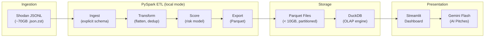
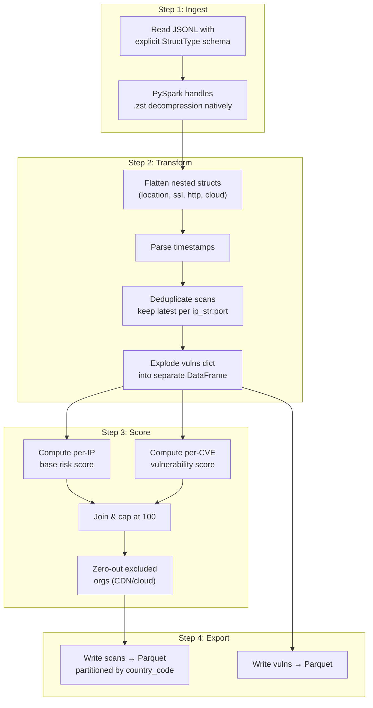
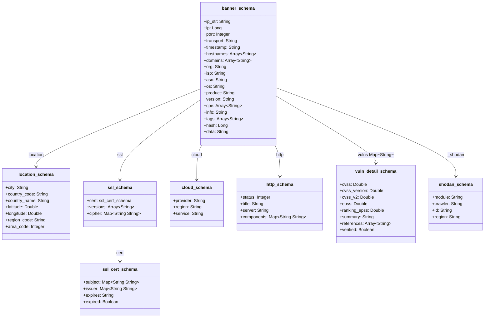
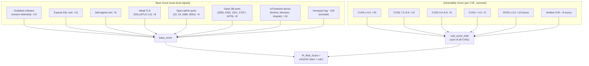
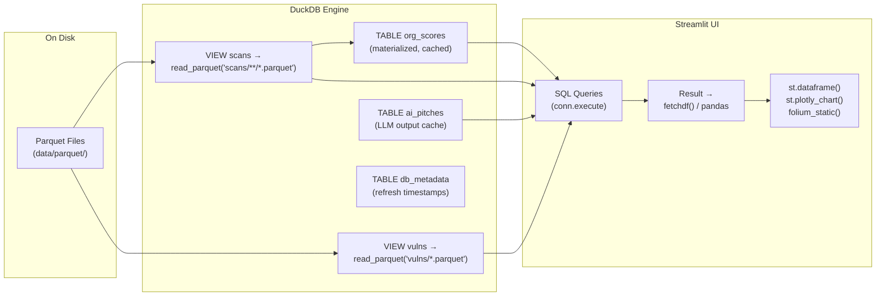
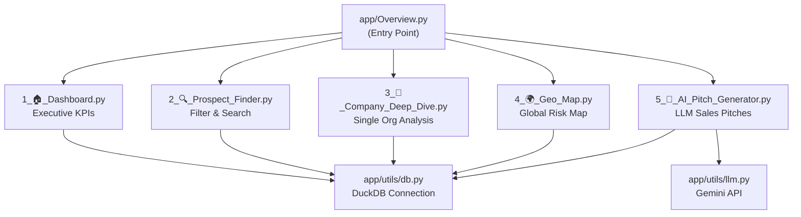

# Architecture Document — CyberProspect

## 1. Executive Summary

**CyberProspect** is a locally-runnable sales intelligence platform for cybersecurity sales teams. It ingests Shodan network scan data (~70GB JSONL), processes it through a PySpark ETL pipeline, stores aggregated results in DuckDB, and presents an interactive Streamlit dashboard for prospecting and targeting businesses with demonstrated cybersecurity weaknesses. An AI-powered sales pitch generator (via free-tier Gemini Flash) enables personalized outreach for the top 500 highest-risk organizations.

---

## 2. Architecture Overview

### 2.1 High-Level Data Flow



### 2.2 Design Decisions

| Decision | Rationale |
|:---|:---|
| **PySpark (local mode)** | Handles ~70GB JSONL efficiently with lazy evaluation, explicit schema, and Parquet output. Demonstrates large-data processing skills without requiring a cluster. |
| **DuckDB** | Zero-config, in-process OLAP engine. Queries Parquet files directly with predicate pushdown. No server needed. Sub-second query performance for the dashboard. |
| **Streamlit** | Python-native UI framework. No frontend build step. Ideal for data-centric prototypes with interactive widgets. |
| **Gemini Flash (free tier)** | Most generous free tier (~1,500 req/day), excellent quality, long context window for enriched pitches. |
| **Parquet (intermediate)** | Columnar format with built-in compression. Enables efficient reads by DuckDB via predicate pushdown and column pruning. |

---

## 3. Data Analysis

### 3.1 Input Format

- **File**: `test_scans.json.zst` (Zstandard-compressed JSONL, ~70GB uncompressed)
- **Format**: Newline-delimited JSON (NDJSON) — one Shodan "banner" per line
- **Sample file**: `test_scans_sample.json` — small subset for development/testing

### 3.2 Schema — Core Fields (100% presence)

| Field | Type | Description |
|:---|:---|:---|
| `ip_str` | string | IP address of the scanned host |
| `ip` | integer | Numeric IP |
| `port` | integer | Port number where service was found |
| `transport` | string | Protocol — `tcp` or `udp` |
| `data` | string | Raw banner/response from the service |
| `timestamp` | string | ISO 8601 scan timestamp |
| `hostnames` | array[string] | Reverse DNS hostnames |
| `domains` | array[string] | Associated domain names |
| `org` | string | Organization that owns the IP |
| `isp` | string | Internet Service Provider |
| `asn` | string | Autonomous System Number (e.g., `AS396982`) |
| `os` | string/null | Detected operating system |
| `location` | object | `{city, country_code, country_name, latitude, longitude, region_code, area_code}` |
| `hash` | integer | Banner hash |
| `_shodan` | object | Crawler metadata: `{module, id, crawler, region}` |

### 3.3 Schema — Enrichment Fields (variable presence)

| Field | Presence | Description | Sales Value |
|:---|:---|:---|:---|
| `vulns` | ~2% | CVE dict with `{cvss, cvss_version, epss, ranking_epss, summary, references, verified}` | 🔴 **CRITICAL** — direct vulnerability evidence |
| `ssl` | ~14% | TLS certificate details: subject, issuer, expiry, versions, cipher suites | 🟡 **HIGH** — expired/weak certs = selling point |
| `http` | ~23% | HTTP response metadata: server, title, status, components | 🟡 **HIGH** — reveals tech stack |
| `product` | ~21% | Identified software product (e.g., "DrayTek Vigor2135 Series") | 🟡 **HIGH** — outdated software detection |
| `version` | ~11% | Software version string | 🟡 **HIGH** — version-based vuln matching |
| `cloud` | ~52% | Cloud provider info: `{provider, region, service}` | 🟢 **MEDIUM** — cloud vs on-prem segmentation |
| `tags` | ~71% | Shodan tags: `cloud`, `cdn`, `starttls`, `self-signed`, `vpn`, `honeypot` | 🟢 **MEDIUM** — filtering & categorization |
| `cpe` / `cpe23` | ~20% | Common Platform Enumeration identifiers | 🟢 **MEDIUM** — standardized product IDs |
| `info` | ~6% | Service-specific info string | 🟢 **LOW** |

> **Note:** At ~70GB, the `vulns` field presence of ~2% still translates to ~1–2 million vulnerable scan records. The scoring model uses **all available signals**, not just explicit CVEs.

---

## 4. ETL Pipeline (`etl/`)

### 4.1 Pipeline Flow



### 4.2 SparkSession Configuration

```python
SparkSession.builder \
    .master("local[*]") \
    .appName("CyberProspect-ETL") \
    .config("spark.driver.memory", "4g") \
    .config("spark.executor.memory", "4g") \
    .config("spark.sql.shuffle.partitions", "100") \
    .config("spark.serializer", "org.apache.spark.serializer.KryoSerializer") \
    .config("spark.sql.jsonGenerator.ignoreNullFields", "true") \
    .config("spark.sql.parquet.compression.codec", "snappy")
```

### 4.3 Explicit PySpark Schema

The schema is defined in `etl/schema.py` using PySpark `StructType` to avoid expensive schema inference on large files:



### 4.4 Transformation Details (`etl/transform.py`)

**Flatten & Clean:**
- Extract `location.city`, `location.country_name`, `location.country_code`, `location.latitude`, `location.longitude` to top-level columns
- Extract `ssl.cert.expired` → `ssl_expired`
- Extract `ssl.versions` → `ssl_versions`
- Extract `http.server` → `http_server`, `http.title` → `http_title`
- Extract `cloud.provider` → `cloud_provider`, `cloud.service` → `cloud_service`
- Parse `timestamp` string to proper Spark `TimestampType`

**Deduplicate:**
```python
# Keep only the latest scan per (ip_str, port)
Window.partitionBy("ip_str", "port").orderBy(col("timestamp").desc())
→ row_number() == 1
```
This typically achieves a 60–70% data volume reduction.

**Explode Vulnerabilities:**
```python
# vulns is a MapType(String → vuln_detail_schema)
# Explode into one row per (ip_str, port, cve_id)
explode("vulns").alias("cve_id", "cve_detail")
```

### 4.5 Parquet Output Tables

| Table | Location | Description | Partitioned By |
|:---|:---|:---|:---|
| `scans` | `data/parquet/scans/` | One row per IP:port scan (deduplicated, scored) | `country_code` |
| `vulns` | `data/parquet/vulns/` | One row per (IP, port, CVE) with CVSS/EPSS | — |

---

## 5. Risk Scoring Model (`etl/score.py`)

### 5.1 Per-IP Risk Score

The IP-level score is a **composite risk indicator** (0–100) computed from multiple signals. This is a **sales prioritization score**, not a vulnerability scanner.

```
IP_Risk_Score = min(100, base_score + vuln_score)
```



### 5.2 Per-Organization Aggregate Score

Organizations are identified by the `org` field and aggregated in DuckDB:

```sql
-- Materialized as the org_scores table in DuckDB
combined_risk_score = LEAST(100.0,
    (max_risk_score × 0.7) +
    (avg_risk_score × 0.3) +
    LEAST(10.0, total_ips × 0.5)
)
```

| Metric | Description |
|:---|:---|
| `total_ips` | Count of distinct IP addresses |
| `total_open_ports` | Count of distinct IP:port combinations |
| `max_risk_score` | Highest single IP risk score (the "sales hook") |
| `avg_risk_score` | Average IP risk score (breadth indicator) |
| `countries` | List of distinct countries where IPs are located |
| `combined_risk_score` | Weighted aggregate — the headline number |

### 5.3 Excluded Organizations

Cloud providers, CDNs, and hosting companies are excluded from prospecting since their `org` field represents the infrastructure owner, not the actual customer:

```python
EXCLUDE_ORGS = [
    "Google LLC", "Amazon.com, Inc.", "Cloudflare, Inc.",
    "Microsoft Corporation", "DigitalOcean, LLC",
    "OVH SAS", "Hetzner Online AG", "Linode",
    "Incapsula Inc", "Fastly, Inc.", "Akamai Technologies",
]
```

Additionally, any IP tagged `cdn` in Shodan is excluded.

---

## 6. Storage Layer

### 6.1 Query Engine: DuckDB (not Pandas)



**Key point:** DuckDB is the SQL engine, not pandas. DuckDB reads the Parquet files directly using its vectorized C++ execution engine. The `.fetchdf()` call merely converts DuckDB's result into a pandas DataFrame for Streamlit to display. The heavy query work (filtering, joining, aggregating) is all done inside DuckDB.

### 6.2 DuckDB Schema (`data/cyberprospect.duckdb`)

```sql
-- Views (lazy, zero-copy over Parquet)
CREATE OR REPLACE VIEW scans AS
    SELECT * FROM read_parquet('data/parquet/scans/**/*.parquet', union_by_name=true);

CREATE OR REPLACE VIEW vulns AS
    SELECT * FROM read_parquet('data/parquet/vulns/*.parquet', union_by_name=true);

-- Materialized table (pre-computed, cached with 10-min TTL)
CREATE TABLE org_scores AS
    WITH base AS (
        SELECT org, COUNT(DISTINCT ip_str) as total_ips,
               COUNT(DISTINCT ip_str || ':' || CAST(port AS VARCHAR)) as total_open_ports,
               MAX(ip_risk_score) as max_risk_score,
               AVG(ip_risk_score) as avg_risk_score,
               LIST(DISTINCT country_name) as countries
        FROM scans
        WHERE org IS NOT NULL AND is_excluded = FALSE
        GROUP BY org
    )
    SELECT *, LEAST(100.0, (max_risk_score * 0.7) + (avg_risk_score * 0.3)
              + LEAST(10.0, total_ips * 0.5)) as combined_risk_score
    FROM base;

-- AI pitch cache
CREATE TABLE ai_pitches (
    org VARCHAR PRIMARY KEY,
    pitch_text TEXT,
    generated_at TIMESTAMP DEFAULT CURRENT_TIMESTAMP,
    tone VARCHAR,
    focus_area VARCHAR
);

-- Metadata for cache management
CREATE TABLE db_metadata (
    key VARCHAR PRIMARY KEY,
    value VARCHAR
);
```

### 6.3 Caching Strategy

- The `org_scores` table is **materialized** (not a view) to avoid re-scanning all Parquet files on every dashboard load.
- A `db_metadata` table tracks the `last_refresh_time`. If older than **10 minutes**, the table is automatically rebuilt on next access.
- A manual **🔄 Rebuild Dashboard Cache** button is available in the sidebar.
- Streamlit's `@st.cache_data` is used on top to cache query results in-process.

---

## 7. Presentation Layer — Streamlit Dashboard (`app/`)

### 7.1 Page Structure



### 7.2 Page Details

| Page | Key Features |
|:---|:---|
| **🏠 Dashboard** | KPI cards (total orgs, total IPs, high-risk count, avg score). Top 10 riskiest orgs bar chart. Risk score distribution histogram. |
| **🔍 Prospect Finder** | Sidebar filters: min risk score, min IPs. Sortable results table with progress-bar risk column. Export-ready view. |
| **🏢 Company Deep Dive** | Org selector dropdown. Risk score progress bar. Summary cards. Exposed infrastructure table. CVE vulnerability table. Link to AI Pitch Generator. |
| **🌍 Geo Map** | Folium map with dark CartoDB tiles. MarkerCluster for performance. Color-coded by risk (red/orange/blue). Risk score filter slider. |
| **🤖 AI Pitch Generator** | Top 500 orgs only. Tone and focus area selectors. Cached pitches in DuckDB. Regenerate button. Fallback template if API fails. |

### 7.3 UI Theming

The app uses a custom dark theme with:
- Background: `#0f111a` (deep navy)
- Sidebar: `#1a1d2d`
- Cards: `#1e293b` with `#334155` borders
- Accent: Linear gradient `#0ea5e9 → #2563eb` (sky blue → royal blue)
- Headers: `#38bdf8` (light sky blue)
- Font: Inter

---

## 8. AI Integration (`app/utils/llm.py`)

### 8.1 LLM Provider: Google AI Studio (Gemini Flash)

| Aspect | Detail |
|:---|:---|
| **Model** | `gemini-3.1-flash-lite` |
| **Free tier** | ~1,500 requests/day |
| **Context** | Org risk data, CVEs, exposed services, SSL issues |
| **Output** | Professional sales outreach email (< 200 words) |
| **Caching** | Pitches stored in `ai_pitches` DuckDB table |
| **Fallback** | Template-based pitch if API fails |

### 8.2 Budget Controls

- Only top 500 organizations (by risk score) are eligible
- Pitches cached in DuckDB — only regenerated on explicit user action
- Fallback template used if API key is missing or API call fails

---

## 9. Project Structure

```
shodan_assignment/
├── ARCHITECTURE.md              # This document
├── README.md                    # Setup & run instructions
├── requirements.txt             # Python dependencies
├── .gitignore
├── setup.bat                    # Windows setup script
├── run.bat                      # Windows launch script
├── check_env.ps1                # Environment diagnostic script
│
├── input/                       # Raw data (large files gitignored)
│   └── test_scans_sample.json   # Small sample for development
│
├── etl/                         # PySpark ETL pipeline
│   ├── __init__.py
│   ├── config.py                # Paths, constants, excluded orgs
│   ├── schema.py                # Explicit PySpark StructType schemas
│   ├── ingest.py                # Step 1: Read raw JSONL
│   ├── transform.py             # Step 2: Flatten, clean, deduplicate
│   ├── score.py                 # Step 3: Compute risk scores
│   ├── export.py                # Step 4: Write Parquet
│   └── run_pipeline.py          # Orchestrator — runs all steps
│
├── data/                        # Processed data (gitignored)
│   ├── parquet/
│   │   ├── scans/               # Partitioned by country_code
│   │   └── vulns/               # Flat Parquet
│   └── cyberprospect.duckdb     # DuckDB database
│
├── app/                         # Streamlit application
│   ├── __init__.py
│   ├── Overview.py              # Entry point, theming, DB init
│   ├── pages/
│   │   ├── 1_🏠_Dashboard.py
│   │   ├── 2_🔍_Prospect_Finder.py
│   │   ├── 3_🏢_Company_Deep_Dive.py
│   │   ├── 4_🌍_Geo_Map.py
│   │   └── 5_🤖_AI_Pitch_Generator.py
│   └── utils/
│       ├── __init__.py
│       ├── db.py                # DuckDB connection & cache management
│       └── llm.py               # Gemini API integration
│
├── hadoop/                      # Windows PySpark compatibility
│   └── bin/
│       ├── winutils.exe
│       └── hadoop.dll
│
├── tests/                       # Test suite (placeholder)
└── docs/                        # Documentation (placeholder)
```

---

## 10. Handling Scale: ~70GB Processing Locally

| Concern | Approach |
|:---|:---|
| **Memory** | 4–8GB Spark driver memory. Spark streams JSONL lazily — does not load entire file into memory. |
| **Time** | Expect 30–60 minutes for full pipeline on a machine with NVMe SSD. |
| **Disk** | Parquet output ~5–10GB (columnar compression via Snappy). |
| **Query speed** | DuckDB queries 10GB Parquet in sub-second via predicate pushdown and column pruning. |
| **Deduplication** | Window function with `row_number()` reduces volume by 60–70%. |
| **Dashboard** | Materialized `org_scores` table avoids re-scanning Parquet on every page load. |

---

## 11. Deployment Options

| Platform | Pros | Cons |
|:---|:---|:---|
| **Streamlit Community Cloud** | Free, one-click deploy from GitHub | 1GB memory limit; must commit pre-processed Parquet. No PySpark at runtime. |
| **Render** | Free tier web service, Docker support | Cold starts on free tier |
| **Railway** | Generous free tier, Docker support | Requires Dockerfile |
| **Self-hosted (local)** | Full control, no limits | Requires port forwarding or ngrok for sharing |

**Chosen approach:** Pre-process data locally with PySpark, commit the Parquet files and DuckDB database to the repo (or Git LFS), then deploy the Streamlit app to **Streamlit Community Cloud**. The app only needs DuckDB + Streamlit at runtime — no Spark or Java required.
